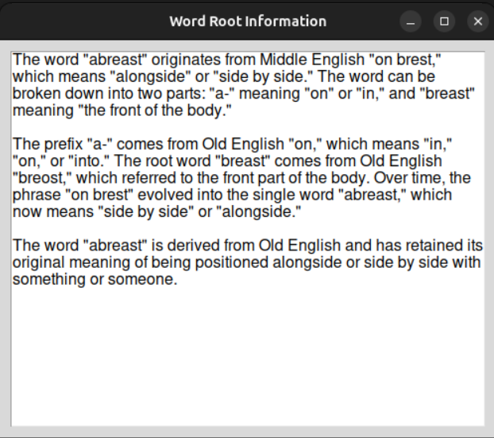

# WORDER
Open-source flashcard source code, suitable for GRE test takers.

Building vocabulary is essential part of test preparation, which take a lot of time. Understanding this painpoint, this open-source project aims to ameliorate this process by introducing digital flashcard written by Python. This source currently only supports [600 GRE words](https://www.youtube.com/watch?v=ztPuECxARHc&t=976s) prepared by **The Test Tutor**, feel free to make contributions to broaden its usage to IELTS, TOEFL, GMAT or any standard testing.


__Demo__
<div style="display: flex; justify-content: center; align-items: center; gap: 10px;">
    
    
</div>

__ChatGPT generated question, example and word root__
<div style="display: flex; justify-content: center; align-items: center; gap: 10px;">
    
    
    
</div>


## Setup
Requirement: Python (3.12.3), Pip (24.3.1)
```
cd worder
make setup
source venv/bin/activate
chmod +x ./build_executable.sh
./build_executable.sh

## Start using WORDER
worder
```

## Usages
| **Shortcut**         | **Action**                               |
|-----------------------|------------------------------------------|
| `Space`              | Flip the flashcard                      |
| `Left`, `Right`      | Navigate between flashcards             |
| `Control + Q`        | Show usage example of the word          |
| `Control + Z`        | Show GRE-like question for the word     |
| `Control + F`        | Focus on search flashcard based on text |
| `Enter`              | Search flashcard                        |
| **If you want to choose different dataset**                      |
| `Control + P`         | Choose different dataset                |
| **If you have CHATGPT API KEY** |                              |
| `Control + L`        | Enter OpenAI API KEY                    |
| `Control + E`        | Generate new usage example of the word  |
| `Control + G`        | Generate new GRE-like question          |
| `Control + Space`    | Generate word root                      | 

## Contribution
Create new branch and pull requests if you want to contribute to this project
